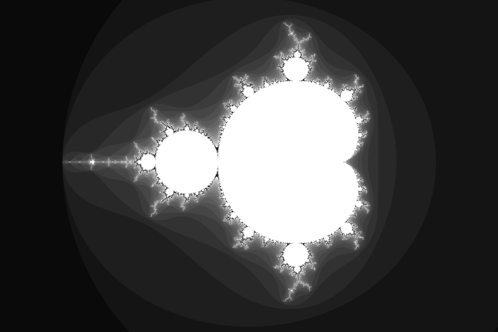

# parallel-processing-ractor-mandelbrot.rb

🥌🥌🥌 Rubyで並列処理(Ractor)でマンデルブロ集合を描画してみる！  

[](https://github.com/osawa-koki/parallel-processing-ractor-mandelbrot.rb/actions/workflows/ci.yml)
[](https://github.com/osawa-koki/parallel-processing-ractor-mandelbrot.rb/actions/workflows/exec.yml)

  

## 実行方法

DevContainerに入り、以下のコマンドを実行します！  

```shell
bundle exec ruby ./app/main.rb
```

実行結果は以下のようになります。  

```result
./app/main.rb:8: warning: Ractor is experimental, and the behavior may change in future versions of Ruby! Also there are many implementation issues.
Hello, Ractor!
                      user     system      total        real
single_thread     8.487484   0.018483   8.505967 (  8.522027)
multi_thread     23.421583  12.001275  35.422858 ( 21.196405)
```

う〜ん、、、  
マルチスレッドの方がかなり遅いですね、、、  
何か実装方法が悪いのかな？？？  

Ractorはまだ試験的な機能なので、今後のアップデートに期待です！  
